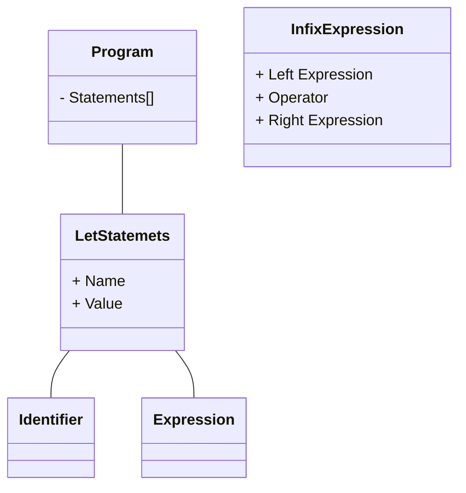

# Ninja Programming Language


```
.           ..         .           .       .           .           .
      .         .            .          .       .
            .         ..xxxxxxxxxx....               .       .             .
    .             MWMWMWWMWMWMWMWMWMWMWMWMW                       .
              IIIIMWMWMWMWMWMWMWMWMWMWMWMWMWMttii:        .           .
 .      IIYVVXMWMWMWMWMWMWMWMWMWMWMWMWMWMWMWMWMWMWMWxx...         .           .
     IWMWMWMWMWMWMWMWMWMWMWMWMWMWMWMWMWMWMWMWMWMWMWMWMWMWMx..
   IIWMWMWMWMWMWMWMWMWBY%ZACH%AND%OWENMWMWMWMWMWMWMWMWMWMWMWMWMx..        .
    ""MWMWMWMWMWM"""""""".  .:..   ."""""MWMWMWMWMWMWMWMWMWMWMWMWMWti.
 .     ""   . `  .: . :. : .  . :.  .  . . .  """"MWMWMWMWMWMWMWMWMWMWMWMWMti=
        . .   :` . :   .  .'.' '....xxxxx...,'. '   ' ."""YWMWMWMWMWMWMWMWMWMW+
     ; . ` .  . : . .' :  . ..XXXXXXXXXXXXXXXXXXXXx.    `     . "YWMWMWMWMWMWMW
.    .  .  .    . .   .  ..XXXXXXXXWWWWWWWWWWWWWWWWXXXX.  .     .     """""""
        ' :  : . : .  ...XXXXXWWW"   W88N88@888888WWWWWXX.   .   .       . .
   . ' .    . :   ...XXXXXXWWW"    M88N88GGGGGG888^8M "WMBX.          .   ..  :
         :     ..XXXXXXXXWWW"     M88888WWRWWWMW8oo88M   WWMX.     .    :    .
           "XXXXXXXXXXXXWW"       WN8888WWWWW  W8@@@8M    BMBRX.         .  : :
  .       XXXXXXXX=MMWW":  .      W8N888WWWWWWWW88888W      XRBRXX.  .       .
     ....  ""XXXXXMM::::. .        W8@889WWWWWM8@8N8W      . . :RRXx.    .
         ``...'''  MMM::.:.  .      W888N89999888@8W      . . ::::"RXV    .  :
 .       ..'''''      MMMm::.  .      WW888N88888WW     .  . mmMMMMMRXx
      ..' .            ""MMmm .  .       WWWWWWW   . :. :,miMM"""  : ""`    .
   .                .       ""MMMMmm . .  .  .   ._,mMMMM"""  :  ' .  :
               .                  ""MMMMMMMMMMMMM""" .  : . '   .        .
          .              .     .    .                      .         .
.                                         .          .         .
```

## Syntax Overview    

```
var x = 10;
var y = 20.3;

function add(a, y) {
    return a + y;
}

if (add(x, y) > 30) {
    x = add(x, add(x, y))
} else {
    x = 100;
}

var numbers = [0, 10, 100, 500];

function loop(array, callback) {
    var item = end(array)
    if (!item) {
        return;
    }
    callback(item)
    loop(array)
}


loop(numbers, function (item) {
    println(item);
});

var total = 100 * 50 / 4.6 + (4 + 4);

var total = total + add(total, 100.50);


var hashMe = {"name":"Jonathan Fontes", "age":"31"};

puts(hashMe["name"]);  
```  

## Builtin Functions  

 - **len** (string, array): Count how many character or many items have an array  
 - **first** (array): Get first item of array E.g.: `first(["ola", 2, 3, 4]); // prints "ola"`    
 - **puts** (mixed): Display any information on screen E.g.: `puts("Hello World"); // print Hello World`  
 - **last** (array): Get last item of array E.g.:  `last([1, 2, 3, "5", false, 0]); // prints 0`  
 - **rest** (array): Get after current item until last one E.g.: `rest([1, 2, 3]); // prints [2, 3]`  
 - **push** (array): Push item to array. E.g.: `push([1, 2, 3], "4"); // print [1, 2, 3, 4]`  


 > Hint: With above functions you can create array map, array reduce, array filter functions, etc.  

## How to install / use  


`.... TODO .....`  


## TODO   

 - Adding more testings or complete 100% coverage testing  
 - Implements "Loop"  
 - Implements more builtin functions to handle Hash  
 - Implement a way to import another scripts  

## Tests  

```
go test -v -race ./...  
```

---- 

This is for future me...  

# Steps  

1. Create Token Structure  
2. Create Lexer
3. Creating Parser
4. Parser produces AST
5. Evaluating AST to give behavior  

# Parser Strategy  

top down operator precedence parser, sometimes called “Pratt parser”

## Var Statement  

```
var <identifier> = <expressions>  
```

Expressions produces values.  
Statements don't.  

```
var x = 5
```

Don't produce a value, but 5 does.  

```
return 5;
```

Don't produce a value, but this does:  

```
function add(x, y) {
    return x + y;
}

add(5, 10); // This produce a value.  
```

Sometime functions literals are expressions:  

```
funcao add(x, y) {  return x + y; }
var add = function(x, y) { return x + y };  
```

### AST  



## Expressions  

Expressions have operator:  

Prefix Operators  

```
-5
!true
!false
```  

Infix Operators (binary operators):  

```
5 + 5
5 - 5
5 / 5
5 * 5
```  

There can be "postfix" operator too, for `5++;`  

Comparison Operators:  

```
foo == bar
for != bar
for > bar
for < bar
for >= bar
for <= bar
```  

Using paratheses to group expressions and influence the order
of evaluation:  

```
5 * (5 + 5)
((5 + 5) * 5) * 5
```  

Call expressions:  

```
add(5, 5);
add(add(5, 5), add(5, 5));
max(5, add(5, (5 * 5)))  
```  

Functions must be first-class citizens   

We also got "if-expressions"  

```
var result = if (10 > 5) { true; } else { false };
```  

## PRATT PARSING  

Top Down Operator Procedence from Vaughan Pratt.  

> is very simple to understand, trivial to implement, easy to use, extremely efficient in practice if not in theory, yet flexible enough to meet most reasonable syntactic needs of users

A crucial part of this idea is that each token type can have two parsing functions associated with it, depending on the token’s position - infix or prefix.  


### Terminology  

Prefix Operator  

```
--3
```  

Postfix Operator  

```
foobar++
```  

Infix Operator  

```
3 * 6
```

It's important to know about Operator Procedence or Order Of Operations  

Each Token Type can have up two parsing functions, it depends if operator is found
at prefix or infix position.  