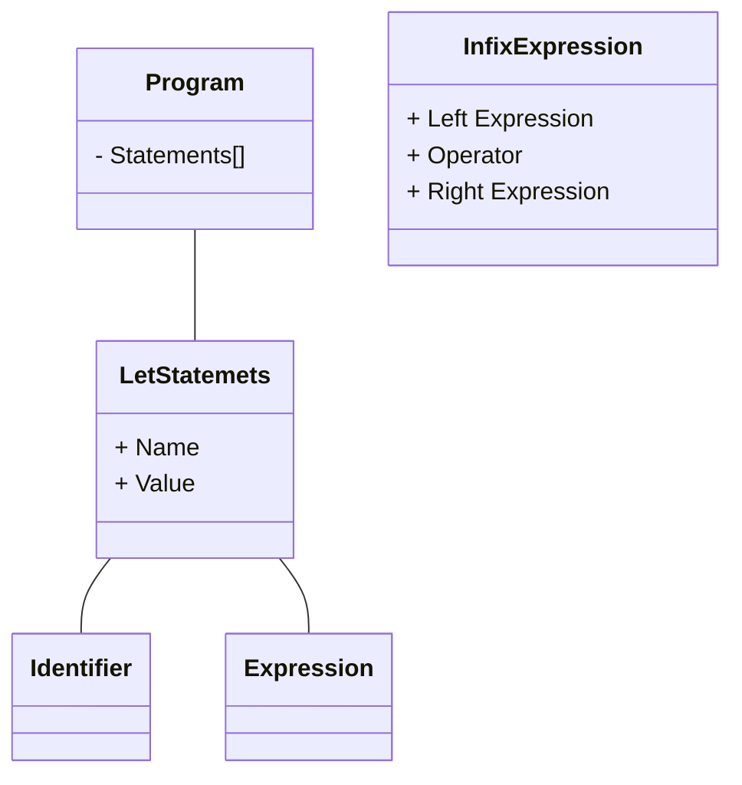

<p align="center">


</p>

[](https://github.com/gravataLonga/ninja/actions/workflows/main.yml)  

# Install  

## Homebrew  

```sh
brew tap gravatalonga/ninja-lang
brew install ninja-lang
```  

## yum/rpm  

To enable, add the following file `/etc/yum.repos.d/fury.repo`:

```sh
[fury]
name=Gemfury Private Repo
baseurl=https://yum.fury.io/gravatalonga/
enabled=1
gpgcheck=0
```  

Check if correctly created  

```
yum --disablerepo=* --enablerepo=fury list available
```  

To install you only need run following command:  

```
yum install ninja-lang  
```  

## apt  

To configure apt access, create a following file `/etc/apt/sources.list.d/fury.list` with content of :  

```  
deb [trusted=yes] https://apt.fury.io/gravatalonga/ /
```  

Or use this one line command:  

```
echo "deb [trusted=yes] https://apt.fury.io/gravatalonga/ /" > /etc/apt/sources.list.d/fury.list
```  

and them you can install  

```
sudo apt install ninja-lang
```

## Manual Download    

Download from [github](https://github.com/gravataLonga/ninja/releases)  

## Manual Installtion  

```sh  
git clone https://github.com/gravataLonga/ninja
cd ninja
go build -o ninja-lang
```  

# Documentation  

For more detail about language, you can check [here](https://ninja.jonathan.pt) (Still working in progress).  

# Demo  

Resolving katas you can check this repository  
https://adventofcode.com/2015

# Syntax  

## Variable  

`var <identifier> = <expression>;`  

Examples  

```
var a = 1;
var a1 = "Name";
var b = 2.0;
var c = a + 1;
var d = a + b;
var e = ++a;
var f = function () {};
var g = [1, 2, 3, "hello", function() {}];
var h = {"me":"Jonathan Fontes","age":1,"likes":["php","golang","ninja"]}
var i = a < b;
var j = true;
var k = !j;

g[0] = 10;
g[4] = "new value"; // it will append to array.  
h["other"] = true;
"ola"[0] // print o  
```  

It's possible to reassign variable for example:  

```
var a = 1;
a = a + 1;  
puts(a);  
```

## Data Types Availables  

```
 /**
  * Booleans
  */
 
 true;
 false;

 /**
  * Integer
  */
 
 1;
 20000;
 
 /**
  * Floats
  */
  
 100.20;
 5.20;
  
 /**
  * Strings
  */
   
 "ola"
 "ola" + " " + "mundo";
   
 /**
  * array
  */
    
 [1, "a", true, function() {}]
    
 /**
  * Objects  
  */
     
 {"key":"value","arr":[],"other":{}}
    
```  

## Comments  

`// <...>` or `/* <...> */`  

Comments can start with double slash `//` ou multiple lines with `\* *\`  

## Functions  

`var <identifier> = function (<identifierarguments>?) { <statements> }`  
`function <identifier> (<identifierarguments>?) { <statements> }`

Functions is where power of language reside, it's a first-citizen function, which mean it can accept function as arguments
or returning function. We got two ways declaring functions, literal or block.  

```
function say(name) {
    puts("Hello: " + name);
}
```

Or  

```
var say = function(name) {
    puts("Hello: " + name);
}
```  

They are exactly same, but this is illegal:  

```
var say = function say(name) {
    puts("Hello: " + name);  
}
```  

### Builtin Functions  
There are severals builtin functions that you can use:  

```
var a = [1, 2, 3, 4];
puts(len(a)); // print 4

puts(len("Hello!")); // print 5  
```

```
var a = [1, 2, 3, 4];
puts(first(a)); // print 1
```

```
puts("Hello World"); // print in screen  
```

```
var a = [1, 2, 3, 4];
puts(last(a)); // print 4
```  

```
var a = [1, 2, 3, 4];
puts(rest(a)); // print [2, 3, 4]; (all but not first)  
```

```
var a = [1, 2, 3, 4];
puts(push(a, 5)); // print [1, 2, 3, 4, 5];
```

## Import  

You can import another ninja files.  

```
import "testing.nj";
```  

## Operators && Logics Operators  

`<expression> <operator> <expression>`  

Logic's Operators  
```
10 < 10;
10 > 10;
10 == 10;
10 != 10;
10 <= 10;
10 >= 10;
10 && 10;
10 || 10;
!10;

```

`<expression>? <operator> <expression>`  
Arithmetics Operators  

```  
1 + 1;
1 - 1;
1 / 1;
1 * 1;  
++1;
--1;

// we take in account procedences  
1 + 1 * 1; // this will be interpreted as (1 + (1 * 1))  
```  

## Data Structures  

### Array  

`var <identifier> = [<expressions>...]`  

```
var a = [1 + 1, 2, 4, function() {}, ["a", "b"]];  
```  


#### Delete index

```
delete a[0];  
```  

It will keep the order  

#### Add Key

```
a[5] = "hello";  
push(a, "anotherKey"); 

// push by empty braces
a[] = 6;  
```  


### Hash  

`var <identifier> = {<expression>:<expression>,....}`

```
var a = {"key":"hello","key" + "key":"hello2", "other":["nice", "other"], 2: true};  
```  

#### Delete Key    

```
delete a["key"];
```  

#### Add Key  

```
a["testing"] = "hello";  
```  


## Conditions  

`if (<condition>) { <consequence> } else { <alternative> }`  

```
if (true) {
    puts("Hello");
} else {
    puts("Yes");
}  
```  

> Note: a value is Truth if isn't null or false, 0 will evaulated like true.  


## Loop  

`for (<initial>?;<condition>?;<iteration>?) { <statements> }`  

> **Heads Up!!** Any of this conditions isn't required, but advice you always put a condition, because there aren't yet a break 
keyword. 

```
var i = 0;
for(;i<=3;++i) {
    puts(i);
}

var a = [1, 2, 3];
for(var i = 0; i <= len(a); ++i) {
    puts(a[i]);
}

for(var i = 0; i <= len(a); i = i + 1) {
    puts(a[i]);
}
```  

## Keywords  

```
var true false function delete
return if else for import  
```

## Tricks  

### Helpers Functions   

#### Array Map  

```
function map(arr, f) {
     function iter(arr, accumulated) { 
          if (len(arr) == 0) {
               return accumulated
          } else {
               return iter(rest(arr), push(accumulated, f(first(arr))));
          } 
     };
     iter(arr, []);
};
```  

Usage:  
```
var a = [1, 2, 3, 4];
function double(x) { 
    return x * 2; 
}
puts(map(a, double)); // prints [2, 4, 6, 8]  
```  

#### Array Reduce  

```
function reduce(arr, initial, f) { 
     function iter(arr, result) { 
          if (len(arr) == 0) {
               return result
          } else {
               return iter(rest(arr), f(result, first(arr)));
          } 
     };

     iter(arr, initial);
};
```  

#### Array Sum  

```
function sum(arr) {
     return reduce(arr, 0, function(initial, acumulated) {
          return initial + acumulated;
     })
}

puts([1, 2, 3, 4]); // prints 10  

```

## Advance usage  

Check at tests for more examples.  

## Tests  

```
go test -v -race ./...  
```

## Profiling && Performance

### Where CPU resources spend more time
Create svg graph:  
[interpreter result](https://github.com/google/pprof/blob/main/doc/README.md#interpreting-the-callgraph)
```
go test -bench=. -cpuprofile cpu.prof  
go tool pprof -svg cpu.prof > cpu.svg  
```  

### Cores

```
go test -bench=. -trace trace.out  
go tool trace trace.out
```  

### Test Race Condition

```  
go test -race
```

---   

# Technical don't read below this line.  

This is for future me...  

# Steps  

1. Create Token Structure  
2. Create Lexer
3. Creating Parser
4. Parser produces AST
5. Evaluating AST to give behavior  

# Parser Strategy  

top down operator precedence parser, sometimes called “Pratt parser”

## Var Statement  

```
var <identifier> = <expressions>  
```

Expressions produces values.  
Statements don't.  

```
var x = 5
```

Don't produce a value, but 5 does.  

```
return 5;
```

Don't produce a value, but this does:  

```
function add(x, y) {
    return x + y;
}

add(5, 10); // This produce a value.  
```

Sometime functions literals are expressions:  

```
funcao add(x, y) {  return x + y; }
var add = function(x, y) { return x + y };  
```

### AST  



## Expressions  

Expressions have operator:  

Prefix Operators  

```
-5
!true
!false
```  

Infix Operators (binary operators):  

```
5 + 5
5 - 5
5 / 5
5 * 5
```  

There can be "postfix" operator too, for `5++;`  

Comparison Operators:  

```
foo == bar
for != bar
for > bar
for < bar
for >= bar
for <= bar
```  

Using paratheses to group expressions and influence the order
of evaluation:  

```
5 * (5 + 5)
((5 + 5) * 5) * 5
```  

Call expressions:  

```
add(5, 5);
add(add(5, 5), add(5, 5));
max(5, add(5, (5 * 5)))  
```  

Functions must be first-class citizens   

We also got "if-expressions"  

```
var result = if (10 > 5) { true; } else { false };
```  

## PRATT PARSING  

Top Down Operator Procedence from Vaughan Pratt.  

> is very simple to understand, trivial to implement, easy to use, extremely efficient in practice if not in theory, yet flexible enough to meet most reasonable syntactic needs of users

A crucial part of this idea is that each token type can have two parsing functions associated with it, depending on the token’s position - infix or prefix.  


### Terminology  

Prefix Operator  

```
--3
```  

Postfix Operator  

```
foobar++
```  

Infix Operator  

```
3 * 6
```

It's important to know about Operator Procedence or Order Of Operations  

Each Token Type can have up two parsing functions, it depends if operator is found
at prefix or infix position.  